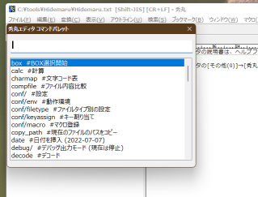

# 秀丸エディタコマンドパレット v1
 

作者: suzu

# 目次
- [秀丸エディタコマンドパレット v1](#秀丸エディタコマンドパレット-v1)
- [概要](#概要)
- [インストール](#インストール)
	- [ファイルの説明](#ファイルの説明)
	- [付属のDLLについて](#付属のdllについて)
	- [コマンドパレットのウインドウについて](#コマンドパレットのウインドウについて)
- [操作方法](#操作方法)
	- [*cmdp.mac*](#cmdpmac)
	- [*hyp.mac*](#hypmac)
- [コマンド](#コマンド)
	- [コマンド文](#コマンド文)
	- [コマンドの機能・動作](#コマンドの機能動作)
- [設定方法](#設定方法)
	- [*cmdp.ini* ファイル](#cmdpini-ファイル)
	- [コマンド定義セクション](#コマンド定義セクション)
	- [特殊セクション](#特殊セクション)
- [更新履歴](#更新履歴)
- [使用について](#使用について)

# 概要
* 「コマンドパレット」を、秀丸エディタ・秀丸メールに導入するマクロです。
* コマンドパレットとは、
	+ 検索型コマンド入力インターフェースから、各種コマンドを呼び出す機能です。
	+ vscodeやWindows Termianlに搭載されていることで有名です。
	+ 望みのコマンドを多数の候補から簡単なキーボード操作で探し出して実行できるので、コマンド数が多くなっても破綻しにくく、近年流行しているインタフェースです。
	+ （実はこのマクロはコマンドパレットのインスパイアではなくて、17年前から作り続けている"comalan"というマクロの後継です）
* コマンドはINIファイルに記述します。
	+ サンプルとして100以上のコマンドが登録されていて、多彩な機能を簡単に試すことができます。
	+ 簡単な書式で多数の独自コマンドを登録できます。
	+ マクロ文、マクロファイル、URLやファイルを開く、独自メニュー作成と、幅広い機能を利用してコマンドを作成できます。
	+ コマンドごとに、秀丸エディタ、メールエディタ、メールメインウインドウの特定のウインドウ上でしか表示されないような設定も可能です。
* 作成したコマンドには、以下の使い道があります
	+ コマンドパレットのコマンドとして
	+ 独自メニューのアイテムとして
		- アクセスキーの設定も可能、二段階キーとしても使える
	+ 外部マクロや、外部プログラムから呼び出し
		- マクロ本体の起動時の引数として、コマンドを指定する
	+ ハイパーリンクのようにテキスト内に埋め込む
		- 付属マクロ *"hyp.mac"* を利用
	+ 付属のマクロ *keyx* と連携してキー割当
* 秀丸ファイラー用の同様のスクリプトも公開します。
	+ 併用すれば、エディタ、メール、ファイラーで同様のコマンド入力インターフェースを利用できるようになります。
* テキストファイルのみの設定なので、機能の同期・複製・テスト・コメントアウトなど、管理が簡単です。

# インストール
* 特に必要な作業はありませんが、以下のような設定をおすすめします。
	+ 展開したフォルダーを秀丸マクロ用のフォルダーに置く
	+ *cmdp.mac* をマクロ登録し、押しやすいキーを割り当てる
		- 簡単に押せるキーを割り当てると（重要！）、使用感がつかみやすくなる
		- 秀丸エディタ・秀丸メール両方使っているなら、両方に登録し、同じキーを割り当てると便利
		- 秀丸ファイラーを利用している場合は、秀丸ファイラー版も導入して、同じキーを割り当てると良い感じになる
	+ *hyp.mac* のマクロ登録とキー割り当てもおすすめ
* 好みに応じて徹底的にカスタマイズしてください。

## ファイルの説明
* *cmdp.mac*
	+ コマンドパレットのマクロ本体
* *cmdp.ini*
	+ 設定用ファイル
	+ この文書では、単に「INIファイル」と表記
* *ht_tools-32.dll*, *ht_tools-64.dll*, *macrodll-32.dll*, *macrodll-64.dll*
	+ コマンドパレットで利用するライブラリ（後述）
* *ht_tools.html*
	+ *ht_tools* のドキュメント
* *hyp.mac*
	+ テキスト中に埋め込まれたコマンドをcmdpマクロに渡すマクロ
	+ テキストやソースコードに各種機能を埋め込んで、ハイパーテキスト的に利用するためのもの
	+ 別のテキストへのリンクや、そのテキストに関連するプログラムの起動などの利用を想定
* *tool.mac*
	+ 短いマクロをまとめて記述するためのファイル
		- サンプルとしていくつか書き込まれている
	+ 十行程度のマクロは、ここに書き込んでINIファイルに登録すると便利
		- 一行でかけるマクロは直接INIファイルに書き込むのが楽
* keyx（フォルダー、ダウンロード元によっては付属していない）
	+ コマンドパレットと連携するキー割り当てツール
	+ 詳細はフォルダー内の *README.html* ファイルを参照

## 付属のDLLについて
* コマンドパレットの動作に必要な *ht_tools.dll*、*macrodll.dll* が同梱されています。
	+ *ht_tools.dll* はh-tom氏が開発したものです。
		- [h-tom氏のサイトの、ht_tools.dllが公開されているページ](http://htom.in.coocan.jp/macro/macro_dll.html#label-16)
	+ *macrodll.dll* は、あべのり氏が開発したものです。
		- [あべのり氏のサイトの、macrodll.dllが公開されているページ](https://www.ms.u-tokyo.ac.jp/~abenori/soft/hidemaru.html)
	+ *macrodll.dll*の4bit対応版はh-tom氏によるものです。
		- [h-tom氏のサイトの、macrodll.dllが公開されているページ](http://htom.in.coocan.jp/macro/macro_dll.html#label-2)
	+ 両氏の許可を得て本パッケージに同梱してあます。
* 32bit用と64bitのファイルを同じディレクトリにおけるようにファイル名を変更してあります。
* 環境にあったDLLが自動的に読み込まれるようになっています。

## コマンドパレットのウインドウについて
* コマンドパレットのウインドウは、*macrodll.dll* の *"EDIT_CREATE"* を利用しています。
* 同梱のdllファイルは、32bit版、64bit版ともに、以下のような改造が施されています。
	+ コマンドパレットとして使いやすいようウインドウと構成要素を大きくし、フォントをモダンなMeiryo-UIに変更
		- 秀丸ファイラー版、コマンドパレットと同じ
	+ 改造には、[*RisohEditor*](https://katahiromz.web.fc2.com/re/ja/)を利用
	+ *EDIT_CREATE* ツールのリソースは、"RT_DIALOG"の102に記述されていて、フォントの種類・サイズ、各要素の大きさなどが編集可能（プログラミングの環境も知識も必要なく、簡単に変更できます）

# 操作方法
## *cmdp.mac*
* *cmdp.mac* がコマンドパレットマクロ本体です。
* コマンドパレットを起動すると、上部に**コマンドの入力ボックス**、下部に**コマンドの候補ボックス**をもつウインドウが表示されます。
	+ 入力ボックスに文字を入力するごとに、候補が絞り込まれます
	+ 上下キーか、スペースキー、shift+スペースキーで候補の移動ができます
	+ タブキーで部分確定、 エンターキーで実行、エスケープキーでキャンセルです。
	+ *macrodll.dll* の *EDIT_CREATE* の仕様で、検索は先頭一致のみです。
* サンプルとして登録されている *google* を実行してみます。
	+ 秀丸エディタか、メールエディタ上で文字列を選択します。
	+ コマンドパレットを起動し、"google"と入力します。
		- おそらく、2文字目、"go"を入力した時点で、*google* にヒットするはずです。
	+ エンターキーを押して実行。
		- 選択した文字列のgoogle検索が実行されます。

## *hyp.mac*
* テキストやソースコード中のコマンドを実行するためのツールです。
	+ 他のファイルやアプリ、ウェブサイトを開くコマンドを挿入すれば、通常のテキストファイルがハイパーテキスト的に利用できるようになります。
* 文字列選択中ならその文字列、そうでないならカーソルがある行の"{"と"}"の間の文字列をコマンドとして解釈し、実行します。

|例                            |動作                                              |
|:-----------------------------|:-------------------------------------------------|
|```{?秀丸}```                 |この行でhyp.macを実行すると、「秀丸」をgoogle検索 |
|```{$mspaint}```              |この行で実行すると、ペイントアプリが起動          |
|```{.}```、または```{here}``` |そのファイルがあるフォルダを開く                  |

* コマンド見つからない場合は以下を試みます
	+ タグジャンプできればタグジャンプ
	+ カーソルの位置がURLやファイル名らしければそれを開く

# コマンド
## コマンド文
* コマンド文は、「コマンド名」と「コマンド引数」(省略可能)からなる
	+ コマンド名とコマンド引数の区切りは、" :;"（スペース、コロン、セミコロン）のいずれかの最初に出現した文字
		- *EDIT_CREATE* ではスペースが入力できないので、このような仕様となっている
* キャプション（コマンドの説明）部分は**無視される**
	+ タブキーで自動補完するとキャプションまで入ってしまうこともあるが、そのまま実行可能
		- ```google  #Google検索``` → ```google```と同じ
	+ キャプションを消さなくても、";"そのまま（セミコロン）の後に引数を書き込める
		- ```google  #Google検索;hidemaru``` → ```google;hidemaru```と同じ
	+ コマンド引数は、マクロやプログラム実行時にその引数として渡される
		- 引数はINIファイルで設定することも可能。両方から受け取った場合、INIファイルのほうが先に渡される
		- コマンドが後述の *open* キーで作成され、引数を必要とする場合、引数が省略されると選択文字列が引数となる（上述の *google* コマンドのような挙動になる）
* コマンドは、"/"（スラッシュ記号）で**グループ化**できる
	+ 例: ```hoge/fuga``` は"hoge"グループに含まれる"fuga"というコマンドとなる
	+ "/"で終わるコマンドは、「グループコマンド」となる
		- グループコマンドを実行すると、そのグループに含まれるコマンドのみのコマンドパレット（グループモード）が再表示される
		- *hidden* で「非表示」指定のコマンドも、グループモードでは表示される
	+ グループコマンドは、**メニューにもなる**
		- メニューのコマンド名は、"menu/グループ名"となる（つまり、それ自体が"menu"というグループに属したコマンドにもなる）
	+ サンプルとして、"help/"や"conf/"が登録されている

## コマンドの機能・動作
* **「表示」**されるコマンドと、**「非表示」**のコマンドがある
	+ 「非表示」とはコマンドパレットの候補リスト及び、独自メニューに**表示されない**という意味
	+ 「非表示」でも**実行は可能**、コマンドが無効になるわけではない
	+ 設定と状態次第で、各コマンドの「表示」「非表示」が切り替わる
* 登録されていないコマンドが入力された場合、以下の実行を試みる
	+ ツールマクロ(*tool.mac*)内にコマンド名に一致するラベルがあれば、それを実行
	+ コマンド名に一致するマクロがあればそれを実行
		- つまり、初期状態でマクロフォルダ直下にあるマクロはすべて「非表示コマンド」と同等ということになります
* 作成したコマンドを外部から実行することも可能
	+ *cmdp.mac*を**引数つき**で呼び出すと、コマンドパレットウインドウを表示せず、その引数文字列を**コマンド文と解釈**して実行する
	+ この機能を利用すれば、以下の様なことも可能
		- 特定のコマンドを**マクロ登録**し、ショートカットキーで直接実行できるようにする
* コマンドは別名を定義すること可能
	+ INIファイルの、aliasで定義

# 設定方法
## *cmdp.ini* ファイル
* コマンドパレットは、設定用INIファイル"cmdp.ini"の編集で設定を行います。
	+ このドキュメントより、**まずはINIファイルを直接見るほうがわかりやすいと思われる**
* INIセクション名 ([]の中の文字列)は大きく分けて、2種類あります。
	+ "_"アンダーバーで始まるものは、「特殊セクション」です。
	+ それ以外のセクションはすべて「コマンド定義セクション」です。

## コマンド定義セクション
* セクション名
	+ コマンド名となる
	+ "_"以外の文字で始まるセクション名はすべてコマンド登録として解釈される
	+ "/"（スラッシュ記号）で、コマンドのグループ化が可能
* *capt*
	+ キャプション。コマンドのひとこと説明
	+ コマンドパレットではコマンド名の後ろに表示される
	+ メニューではメニューアイテムの表示名となる
	+ 省略可能だが、なるべく書かないと自分でわからなくなる
	+ 裏技: 変数 *$capt* になにか代入するマクロ文を記述するとevalされるので、日付なども表記できる
* *mac_cmd*
	+ マクロコマンド文。";"（セミコロン）で区切れば、複数行分のマクロも記述可能
	+ 変数 *$cmd_arg* に引数文字列が入った状態で実行(eval)される
* *mac*
	+ 実行するマクロファイル名
	+ 拡張子".mac"は省略可能
	+ 秀丸エディタに登録されているマクロディレクトリの場合は、ディレクトリ名も省略可能
	+ マクロディレクリ直下のマクロファイルと同名ディレクトリ中の場合も、ディレクトリ名を省略可能
		- 例: ..\Hidemaru\Macro\hoge\hoge.mac → hoge
* *open*
	+ Windowsシェルで開く
	+ ファイル名やURLを指定
	+ 文字列中の *"%arg%"* は、引数文字列におきかえられる
	+ 引数文字列が省略された場合、エディタ上の選択文字列を引数として受け取る
* *tool*
	+ toolコマンド。付属の*tool.mac*内のコマンドを実行
	+ *tool.mac* 内の該当するルーチンのラベルを指定する
	+ *tool.mac* のマクロでは、引数は第二引数( *getarg(1)* )で受け取る
		- 第一引数はツールのラベルになるので
	+ *tool.mac* に記述した時点でコマンドとしては成立するが、コマンド登録しないと「非表示」と同じ状態
* *tool2*
	+ toolコマンドと同様の、*tool2.mac*という別ファイル上のマクロを実行
	+ 新機能の js{} など、秀丸メールが対応していないマクロ文法を利用する場合など、マクロを分けたいときに利用
* *arg*
	+ mac, toolなどへ渡す引数を指定
	+ コマンドが引数付きで呼ばれた場合は、この引数のあとに付け加えられる
* *window*
	+ これが指定されているコマンドは、そのウインドウ上のみ、そのコマンドが「表示」される
	+ 以下の文字の組み合わせで指定

|文字                   |ウインドウ                                            |
|:----------------------|:-----------------------------------------------------|
|h                      |秀丸エディタ                                          |
|e                      |秀丸メールエディタ                                    |
|m                      |秀丸メールメインウインドウと検索結果ウインドウ        |
|(上の組み合わせ) 例:mh |例: 秀丸エディタ or メールメインウインドウ            |
|editor                 |秀丸エディタ or メールエディタ ("he"と同義)           |
|mail                   |メールエディタ or メールメインウインドウ ("me"と同義) |

* *ext*
	+ ファイルの拡張子を指定する
	+ この値が指定されているコマンドは、その拡張子のファイル上のみ「表示」となる
		- その言語に特有の機能や、ドキュメントページなどに
	+ 拡張子前のピリオドが必要、スペース区切りで複数指定可能
		- 例: *.md .txt*
* *hidden*
	+ 1を指定すると、そのコマンドは「非表示」となる
	+ これを指定しても、メニュー上やグループモードでは、「表示」される
* *menu*
	+ 独自メニューを出す
	+ コマンド名をスペース区切りで記述
	+ "-"は区切り線になる
	+ サブメニューは作れないが、メニューを出すメニューアイテムも設定可能なので、それで代用可能
		- 組み合わせ次第で、複雑な構造のメニューや巡回するメニューも作成可能
	+ サンプルのメニューコマンドは、"menu"というグループに属するコマンドとして登録されている
		- そうする必要がある訳ではない
		- "menu/menu"コマンドは全メニューをメニュー表示（メニューのメニュー）
* *key*
	+ コマンドがメニューアイテムとして利用されたときのアクセスキーを指定
* 備考
	+ *mac_cmd*, *mac*, *open*, *tool*の値を"-"（ハイフン）とすると、コマンド名と同じ文字列とみなされる

## 特殊セクション
* *_alias*
	+ コマンドの別名を登録
	+ 例として次のような項目が登録されている

|ini例          |コマンド     |動作                                   |
|:--------------|:------------|:--------------------------------------|
|*.=here*       |. (ピリオド) |開いているテキストのあるフォルダを開く |
|*1=setfocus;4* |1            |ファイルマネージャー枠にフォーカス     |
|*2=setfocus;2* |2            |アウトライン枠にフォーカス             |

* *_alias_head*
	+ 先頭一致の別名を登録
	+ 区切り文字関係なしに、入力されたコマンド文の頭の部分が一致したら、その部分が置き換えられる
		- 一致した部分以降の文字列はコマンド引数になる
		- コマンドパレット自体よりも、*hyp.mac* 向けの機能
	+ 例として次のような項目が登録されている

|ini例           |コマンド例     |動作                 |意味                            |
|:---------------|:--------------|:--------------------|:-------------------------------|
|```>=mac_cmd``` |```>newfile``` |新規ファイル         |マクロ文 *newfile* が実行される |
|```?=google```  |```?秀丸```    |「秀丸」をgoogle検索 |コマンド文 "google 秀丸" と解釈 |
|```$=run```     |```$mspaint``` |ペイントアプリを開く |コマンド文 "run mspaint" と解釈 |

* *_config*
	+ debug_mode: 0でデバッグ出力なし、1でアウトプット枠、2でデバグモニターツール
	+ debug_monitor_path: デバッグモニター実行ファイルのパス

# 更新履歴
* v1
	+ 別途必要なものをなくした
		- 必要なDLLをすべてを同梱（作者のあべのり氏、h-tom氏に許可をいただきました）
	+ キー割当ツールの *keyx* を同梱
	+ グループコマンドの動作を秀丸ファイラー版コマンドパレットと同様にした
		- グループコマンドは、自動的にメニューとしても登録される、など
	+ ドキュメントの改善
		- 引数についての記述足りてなかった、など
	+ その他、たくさん
* 無印
	+ 公開

# 使用について
* 同梱のdllファイルは、本パッケージ開発者suzuによるものではありません。
	+ *ht_tools.dll* は、h-tom氏によるものです。
	+ *macrodll.dll* は、32bit版があべのり氏によるもの、その64bit版はh-tom氏によるものです。
	+ *macrodll.dll*については、本スクリプト開発者suzuにより、リソース情報が変更されいています。
	+ 両氏の許可を頂いて改変、同梱しています。
* その他のコード、文書、データについては、使用、複製、改造、再配布に制限はありません。
* 無保証です。

